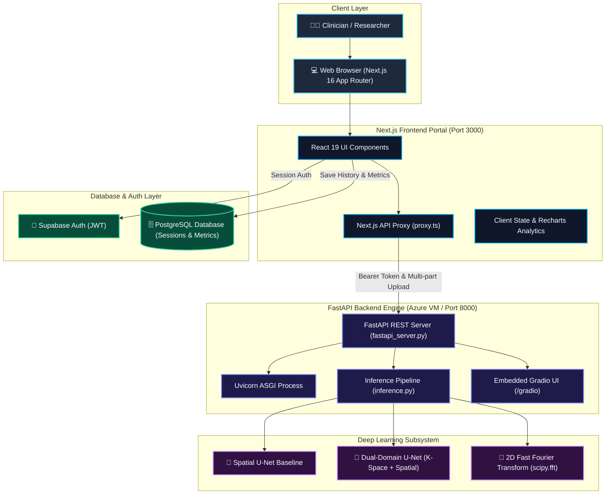
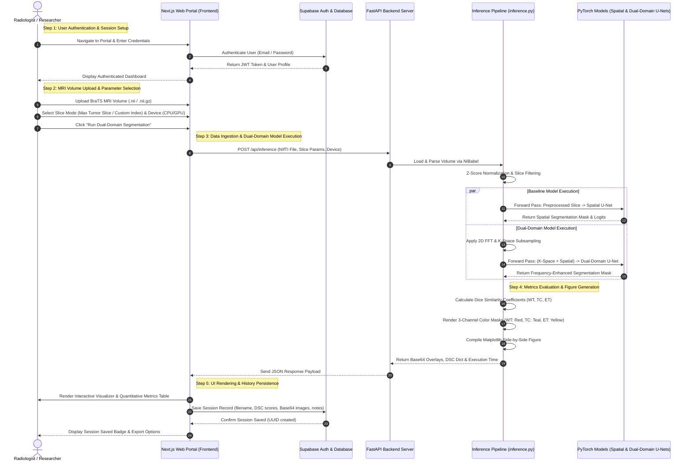
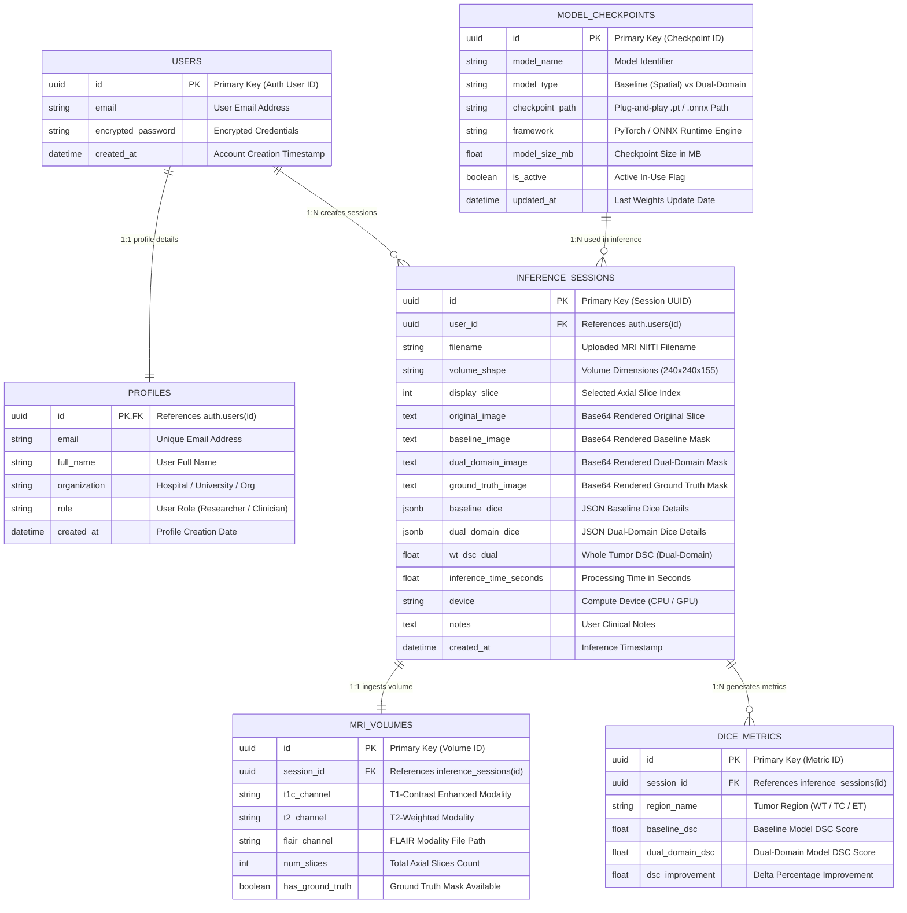
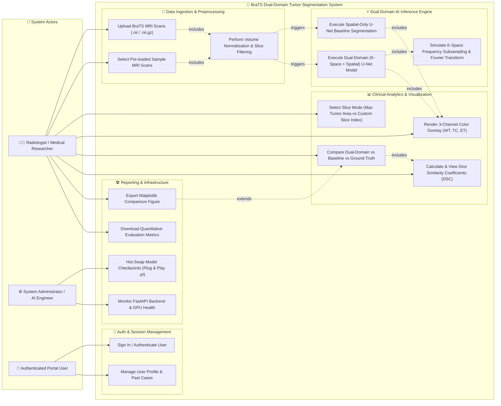

# 🧠 Dual-Domain Brain Tumor Segmentation System

> **A High-Performance Frequency-Spatial Deep Learning Framework & Clinical Web Portal for BraTS Multi-Modal MRI Segmentation**

[](https://nextjs.org/)
[](https://react.dev/)
[](https://fastapi.tiangolo.com/)
[](https://pytorch.org/)
[](https://supabase.com/)
[](https://tailwindcss.com/)

---

## 📌 Executive Summary

The **Dual-Domain Brain Tumor Segmentation System** is a medical deep learning application designed to demonstrate state-of-the-art dual-domain (`K-Space Frequency Domain` + `Spatial Domain`) neural network segmentation on multi-modal MRI scans (**BraTS 2023 GLI Benchmark**).

By combining Fast Fourier Transform (FFT) frequency-domain features with 2D spatial context, the proposed **DualDomainUNet** achieves superior segmentation accuracy on complex tumor sub-regions—including **Whole Tumor (WT)**, **Tumor Core (TC)**, and **Enhancing Tumor (ET)**—compared to standard spatial-only U-Net baselines.

The system features a **Next.js 16 Web Portal** for interactive slice navigation, model output comparison, quantitative **Dice Similarity Coefficient (DSC)** analytics, and clinical PDF report generation, backed by an asynchronous **FastAPI + ONNX/PyTorch** model serving engine.

---

## ✨ Key Features

- **🌐 Dual-Domain Neural Architecture**: Evaluates frequency-space $K$-space features alongside spatial representations using PyTorch & ONNX Runtime.
- **📄 Multi-Modal NIfTI Volume Ingestion**: Supports `.nii` and `.nii.gz` BraTS scans (T1-contrast, T2, FLAIR) with zero-slice filtering and $Z$-score normalization.
- **🔍 Interactive Slice Visualizer**: Slide across 3D axial dimensions or auto-detect the slice with maximum tumor burden.
- **🎨 3-Channel Color Overlay Rendering**: Color-coded tumor region masks:
  - 🔴 **Whole Tumor (WT)** — Red Overlay
  - 🟢 **Tumor Core (TC)** — Teal Overlay
  - 🟡 **Enhancing Tumor (ET)** — Yellow Overlay
- **📊 Real-time DSC Metrics & Comparative Analytics**: Side-by-side comparative benchmarks showing performance gains ($\Delta\text{DSC}$) against baseline spatial models.
- **🔒 Authenticated History & Auditing**: Supabase Auth & PostgreSQL storage for historical case retrieval and clinical notes (`inference_sessions` & `dice_metrics`).
- **📥 One-Click Clinical PDF Export**: Generate multi-page quantitative reports containing overlay figures, metric tables, and physician annotations.
- **🔌 Plug-and-Play Checkpoints**: Hot-swappable `.pt` model weight files without application downtime or code modification.

---

## 🛠️ Technology Stack

| Layer | Technologies | Purpose |
| :--- | :--- | :--- |
| **Frontend Web Portal** | Next.js 16 (App Router), React 19, TypeScript 5, Tailwind CSS v4, Recharts, jsPDF, html2canvas | Interactive visualizer, client-side state management, responsive UI & clinical PDF exports |
| **Backend & API Server** | FastAPI, Uvicorn (ASGI), Python 3.10+, Gradio (embedded UI) | High-throughput REST API, streaming proxy endpoints, and research presentation UI |
| **AI Deep Learning Engine** | PyTorch, ONNX Runtime, NiBabel, SciPy (`scipy.fft`), NumPy, Matplotlib | Model inference (`DualDomainUNet`, `SpatialUNet`), 3D NIfTI parsing, K-Space FFT, & overlay generation |
| **Database & Auth** | Supabase (PostgreSQL), Supabase Auth (JWT), Row Level Security (RLS) | Authenticated access control, user profile management & structured session history persistence |
| **Infrastructure & CI/CD** | Azure Virtual Machine (Ubuntu Linux), Systemd (`brain-tumor-api`), GitHub Actions | Production cloud deployment, process daemon management, and SSH deployment automation |

---

## 🏗️ System Architecture



---

## 📐 System Diagrams & Specifications

<details>
<summary><b>🔄 Sequence Diagram (Execution Flow)</b></summary>


</details>

<details>
<summary><b>🗄️ Entity-Relationship Diagram (ERD)</b></summary>


</details>

<details>
<summary><b>👨‍⚕️ Use Case Diagram</b></summary>


</details>

---

## 📁 Repository Directory Structure

```
.
├── demo/                       # FastAPI Backend & Inference Subsystem
│   ├── app.py                  # Gradio interactive demonstration app
│   ├── fastapi_server.py       # Asynchronous FastAPI backend REST server
│   ├── inference.py            # Preprocessing, FFT K-Space simulation & overlay pipeline
│   ├── models.py               # PyTorch neural network definitions (SpatialUNet & DualDomainUNet)
│   ├── requirements.txt        # Python backend dependencies
│   ├── checkpoints/            # Plug-and-play model weights (.pt files)
│   │   ├── baseline_best.pt    # Spatial U-Net trained weights
│   │   └── dual_best.pt        # Dual-Domain U-Net trained weights
│   └── start_backend.sh        # Uvicorn production start script
│
├── portal/                     # Next.js 16 Web Portal Frontend
│   ├── app/                    # Next.js App Router pages (login, dashboard, visualizer)
│   ├── components/             # React 19 UI components (metrics tables, slice sliders)
│   ├── proxy.ts                # Next.js API proxy to FastAPI backend
│   ├── supabase/               # SQL schema definitions & RLS security policies
│   │   └── schema.sql          # Database table definitions
│   └── package.json            # Node.js frontend dependencies
│
├── diagrams/                   # System Architecture & Technical Diagrams
│   ├── architecture.mmd        # C4 System Architecture Mermaid diagram
│   ├── Sequence-Diagram.mmd    # End-to-end execution sequence diagram
│   ├── Entity-Relationship-Diagram.mmd # Database ERD diagram
│   └── usecase.mmd             # System Use Case diagram
│
├── .github/workflows/          # CI/CD Deployment Automation
│   └── deploy-backend.yml      # GitHub Actions SSH script to Azure VM
└── text.txt                    # Academic implementation details for research thesis
```

---

## 🚀 Quick Start & Local Setup

### Prerequisites

- **Python 3.10+** (with `pip` and virtual environment support)
- **Node.js 18+** & `npm`
- **Git**

---

### 1. Backend Setup (`/demo`)

```bash
# Navigate to the backend directory
cd demo

# Create and activate a Python virtual environment
python3 -m venv venv
source venv/bin/python activate

# Install Python backend dependencies
pip install -r requirements.txt

# Start the FastAPI server (runs on http://localhost:8000)
./start_backend.sh
```

> **Health Check Verification**: Open `http://localhost:8000/api/health` in your browser. Expected output:
> ```json
> {
>   "status": "healthy",
>   "models_loaded": {
>     "baseline": true,
>     "dual_domain": true
>   }
> }
> ```

---

### 2. Frontend Web Portal Setup (`/portal`)

```bash
# Navigate to the portal directory
cd portal

# Install Node.js dependencies
npm install

# Configure environment variables (.env.local)
cp .env.local.example .env.local
```

Add your Supabase and API credentials to `.env.local`:

```ini
NEXT_PUBLIC_SUPABASE_URL=https://your-supabase-id.supabase.co
NEXT_PUBLIC_SUPABASE_ANON_KEY=your-supabase-anon-key
FASTAPI_BACKEND_URL=http://localhost:8000
```

Start the Next.js development server:

```bash
npm run dev
```

Open `http://localhost:3000` to launch the **Dual-Domain Brain Tumor Segmentation Portal**.

---

## 📡 API Endpoint Reference

### `POST /api/inference`
Executes spatial baseline and dual-domain inference on an uploaded `.nii` / `.nii.gz` volume.

- **Content-Type**: `multipart/form-data`
- **Request Body**:
  - `file`: NIfTI Volume File (`.nii` or `.nii.gz`)
  - `slice_mode`: `"max_tumor"` or `"custom"`
  - `slice_idx`: Integer index (optional, required if `custom`)
  - `device`: `"cpu"` or `"cuda"`
- **Response**: `application/json` containing Base64 encoded slice previews, tumor overlays, and Dice Similarity Coefficients.

### `GET /api/health`
Returns system status, active device (CPU/GPU), and model checkpoint loading status.

---

## ☁️ Cloud Deployment (Azure VM & GitHub Actions)

The backend API is deployed on an **Azure Virtual Machine** running Ubuntu Linux, managed via **Systemd**:

```bash
# Systemd service status check on Azure VM
sudo systemctl status brain-tumor-api
```

Automated deployments are configured via `.github/workflows/deploy-backend.yml`. Pushing changes to `demo/` triggers an automated deployment to the Azure environment.

---

## 📜 Citation & Research Acknowledgments

If you use this codebase or dual-domain architecture in your research, please cite:

```bibtex
@article{brats_dual_domain_2026,
  title={Dual-Domain Brain Tumor Segmentation via Combined K-Space Frequency Subsampling and Spatial U-Nets},
  author={Chithraka et al.},
  journal={BraTS Research & Medical Computer Vision},
  year={2026}
}
```

- **Dataset**: [BraTS 2023 Adult Glioma Challenge Dataset](https://www.synapse.org/Synapse:syn51156910/wiki/622351)
- **Frameworks**: PyTorch, FastAPI, Next.js, Supabase, NiBabel

---

## 📄 License

Distributed under the **MIT License**. See `LICENSE` for more information.
